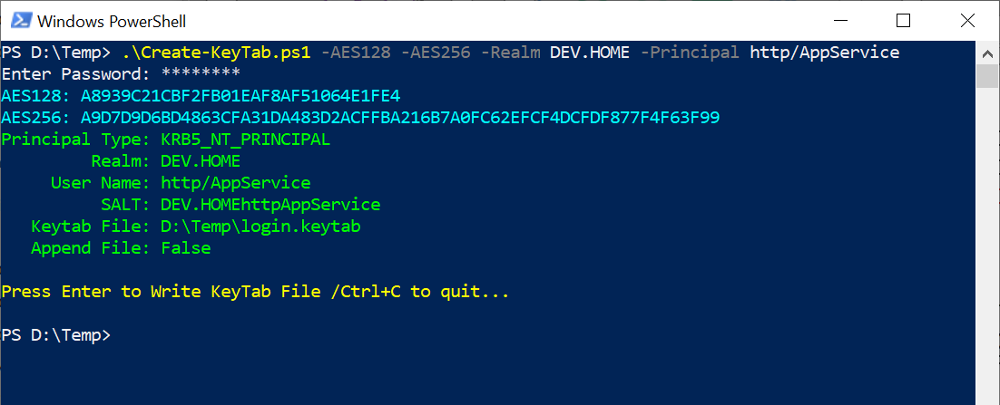
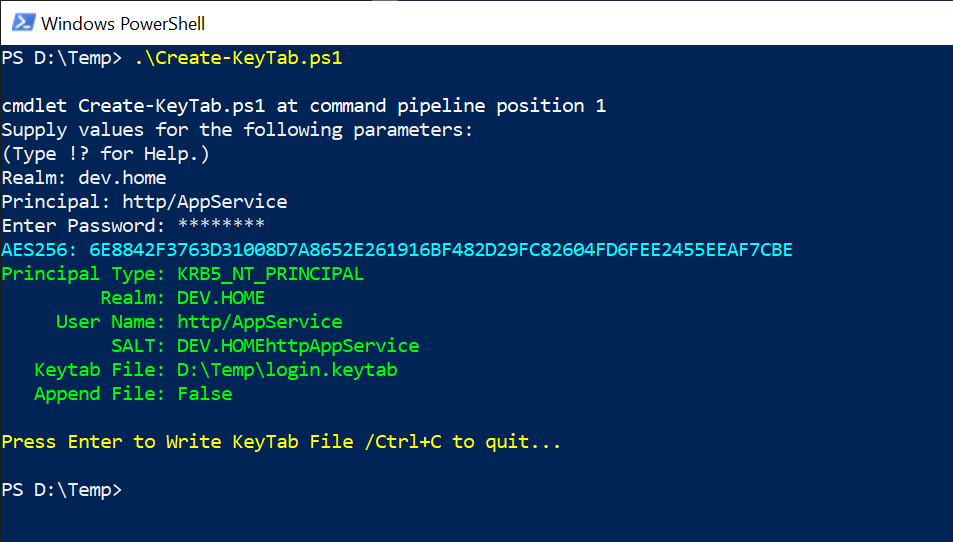

<html>
<head>
<meta http-equiv="Content-Type" content="text/html; charset=utf-8"/>
<meta name="viewport" content="width=device-width, initial-scale=1">
<meta name="google-site-verification" content="QtiCpHJXx6ze17AIVUJso8v0cXoF4LGjsCkYLR6ByIk" />
<meta name="keywords" content="PowerShell,KeyTab,Key Tab,generate,active directory,creation,automate,batch,kerberos,create-keytab,create keytab, create keytab file,generate keytab,ktpass">
</head>
<body>
<a href="https://github.com/TheRealAdamBurford/Create-KeyTab">Create KeyTab Project</a> 
<h2 id="Create-Keytab-ps1">Create A KeyTab File Using PowerShell</h2>
This scipt will generate off-line keytab files for use with Active Directory (AD). While the script is designed to work independently of AD, this script can be used with a wrapper script that uses Get-ADUser or Get-ADObject to retrieve the UPN of a samaccountname or a list of samaccountnames for use in batch processing  of KeyTab creation.

<h3 id="Requirements">Requirements</h3>

<ul>
    <li>Windows 10/2016 System (PowerShell Version 5.1.16299.1146). Earlier versions may work.</li>
    <li>The UPN used to generate the KeyTab must match with the one used in AD.</li>
    <li>The primary/principal part of the UPN is case sensitive.</li>
    <li>The REALM is always hashed using upper case.</li>
</ul>

<h3 id="Examples">Examples</h3>

<h4 id="Example01">Create a KeyTab file with parameters.</h4>

<i>PS D:\Temp> .\Create-KeyTab.ps1 -AES128 -AES256 -Realm DEV.HOME -Principal http/AppService</i>

<h4 id="Example02">Create a KeyTab without parameters.</h4>

<i>PS D:\Temp> .\Create-KeyTab.ps1</i>

Deafult encryption is AES-256.

When creating a keytab with AES the SALT the primary/principal part of the UPN is case sensitive. The realm portion is hashed uppercase, even if is not uppercase in the UPN attribute. The script forces the realm to uppercase

<h4 id="Parameters">Optional Parameters</h4>

<table id="Table1" border="0">
<tr>
<td class="cell0">-SALT</td>
<td class="cell1">:Use a custom SALT</td>
</tr>
<tr>
<td class="cell2">-File</td>
<td class="cell3">:KeyTab File Path. Default = CurrentDirectory\login.keytab</td>
</tr>
<tr>
<td class="cell0">-KVNO</td>
<td class="cell1">:Default = 1. Exceeding 255 will wrap the KVNO. THe 32bit KVNO field is not implimented.</td>
</tr>
<tr>
<td class="cell0">-PType</td>
<td class="cell1">:Default = KRB5_NT_PRINCIPAL</td>
</tr>
<tr>
<td class="cell0">-RC4</td>
<td class="cell1">:Generate RC4 Key</td>
</tr>
<tr>
<td class="cell0">-AES128</td>
<td class="cell1">:Generate AES128 Key</td>
</tr>
<tr>
<td class="cell0">-AES256</td>
<td class="cell1">:Generate AES256 Key</td>
</tr>
<tr>
<td class="cell0">-Append</td>
<td class="cell1">:Append Key Data to an existing KeyTab file.</td>
</tr>
<tr>
<td class="cell0">-Quiet</td>
<td class="cell1">:Suppress Text Output</td>
</tr>
<tr>
<td class="cell0">-NoPrompt</td>
<td class="cell1">:Suppress Write KeyTab File Prompt</td>
</tr>
</table>

<h5>From MS-KILE 3.1.1.2 Cryptographic Material</h5>

KILE concatenates the following information to use as the key salt for principals:

<ul>
<li>User accounts: \< DNS of the realm, converted to upper case\> | \<user name\></li>
<li>Computer accounts: \< DNS name of the realm, converted to upper case \> | "host" | \< computer name, converted to lower case with trailing "$" stripped off \> | "." | \< DNS name of the realm, converted to lower case \></li>
</ul>

</body>
</html>
